# k-Means Clustering Analysis - COVID-19 Infection Rate, Digital Propensity and Access to Amenities
## Executive Summary
### Findings

The analysis identified five distinct clusters of areas each with unique characteristics related to digital capability, availability of local amenities and COVID-19 outcomes. Crucially, higher digital propensity was associated with lower average infection rates at an area level, even when access to physical amenities (like supermarkets and sports centres) was limited. 

In practical terms, this means that individuals and areas lacking remote-work capability or with lower digital confidence could be interpreted as being disproportionately affected during the COVID-19 pandemic, as they had fewer alternatives to in-person activities. Though it is important to remember that correlation =/= causation and this analysis should act as a guide for further analysis.

One cluster stood out for having the highest COVID-19 rates by a wide margin; notably, this cluster did not have extreme values in digital or amenities, suggesting that other unmeasured factors (such as housing density, occupation types, or institutional settings) contributed to the heightened infection levels there. 

However, it is important to note that underlying biases and confounding factors (such as job type, income levels, deprivation, and demographic differences) play a role and overlap with these findings. For instance, many communities with low digital scores are also economically deprived or have older populations – factors which themselves contributed to higher COVID vulnerability. Such influences provide additional explanatory power when interpreting the results, and they temper any one-dimensional conclusion. 

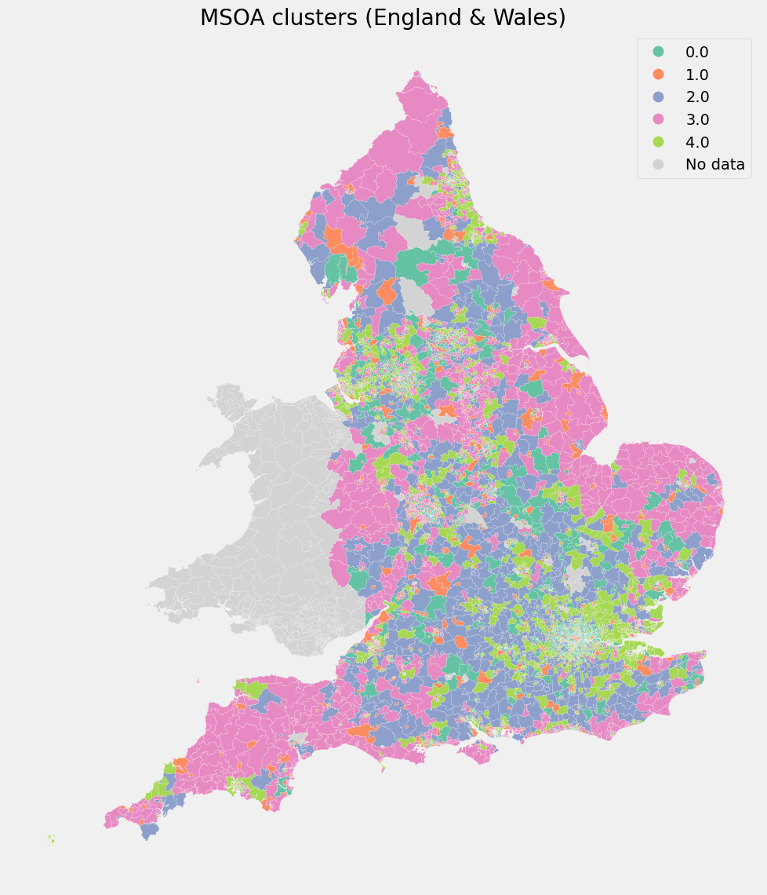

***

| Cluster | Mean Digital Propensity Score | Mean Covid 19 Inf Rate | Mean Supermarkets | Mean Sports Facilities | Observations |
|:------- |:------------------------------|:-----------------------|:------------------|:-----------------------|:-------------|
| 0	      | 0.953	                        | 289.7	                 | 1.48	             | 8.26	                  | 1322         |
| 1	      | 0.940	                        | 301.9	                 | 5.86	             | 17.65	                | 721          |
| 2	      | 0.943	                        | 312.4	                 | 1.92	             | 30.96	                | 1016         |
| 3	      | 0.921	                        | 306.6	                 | 1.89	             | 11.87	                | 1745         |
| 4	      | 0.944	                        | 353.6	                 | 1.48	             | 10.09	                | 1873         |

***
***

#### Cluster 0 - Digitally Enabled, Low-Amenity Areas

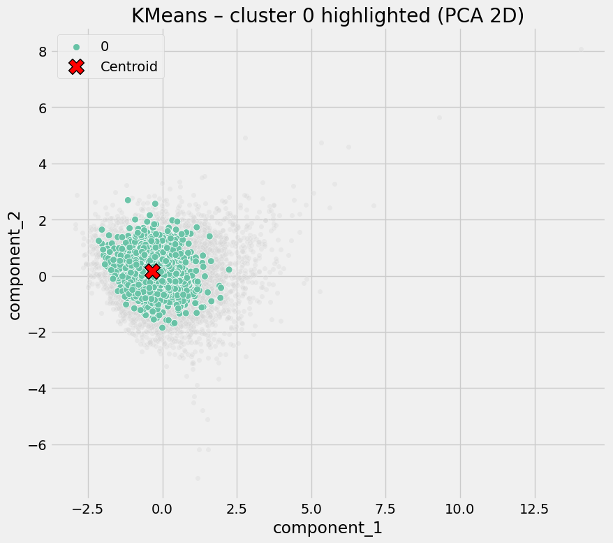

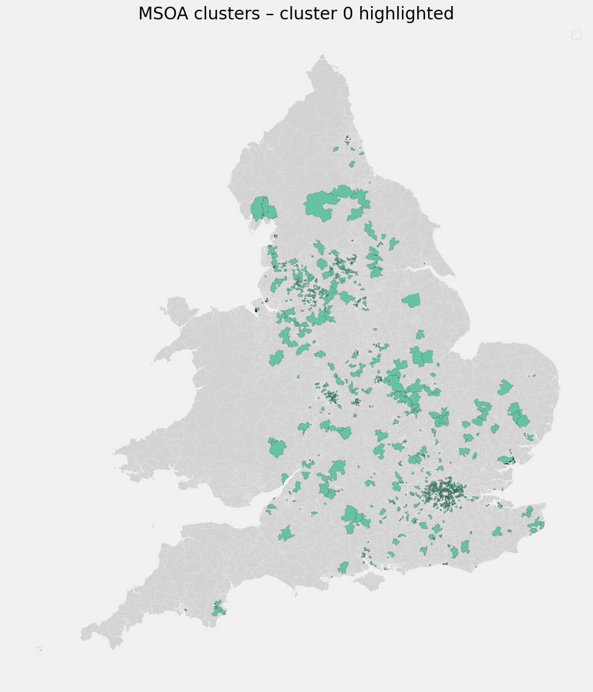

| Cluster | Mean Digital Propensity Score | Mean Covid 19 Inf Rate | Mean Supermarkets | Mean Sports Facilities | Observations |
|:------- |:------------------------------|:-----------------------|:------------------|:-----------------------|:-------------|
| 0	      | 0.953	                        | 289.7	                 | 1.48	             | 8.26	                  | 1322         |

Defining characteristics:
  - Moderate to high digital propensity
  - Low access to physical amenities (few supermarkets, few sports facilities)
  - Lower average COVID rates

<b>Interpretation</b>

These areas are characterised by higher digital inclusion which is consistent with greater potential for remote working and reduced reliance on in‑person services.


#### Cluster 1 - Commercial & Retail Activity Centers

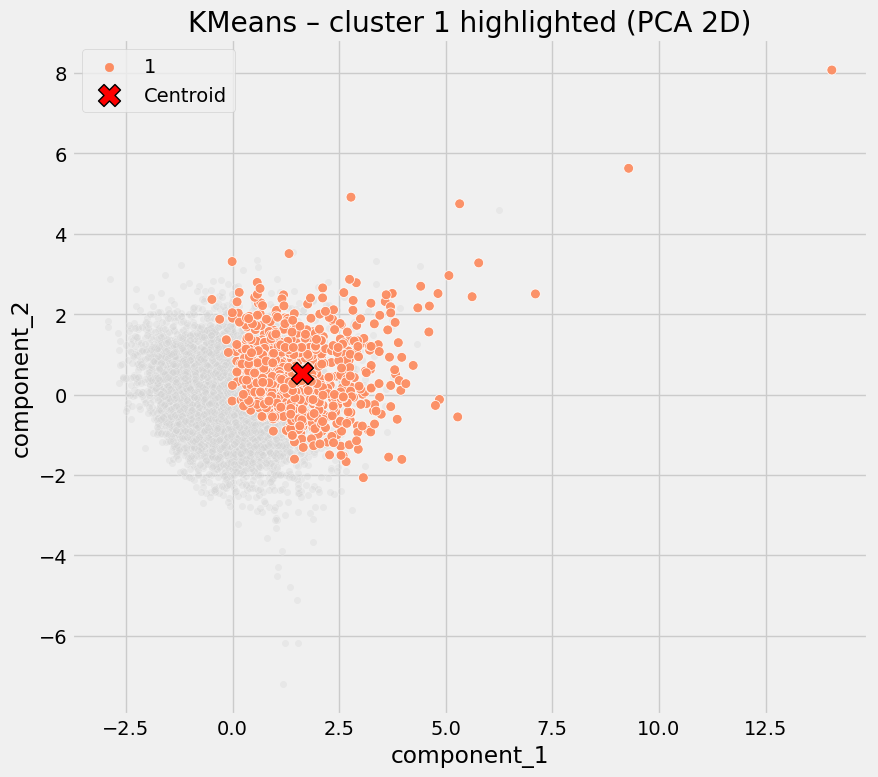

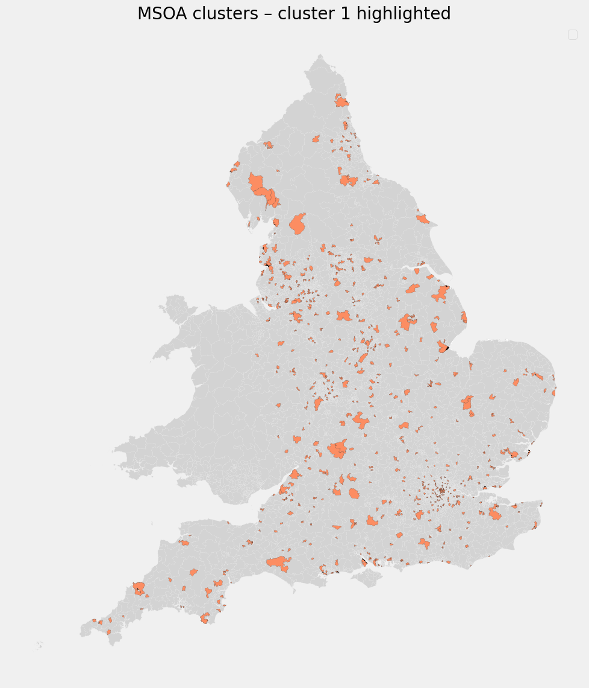

| Cluster | Mean Digital Propensity Score | Mean Covid 19 Inf Rate | Mean Supermarkets | Mean Sports Facilities | Observations |
|:------- |:------------------------------|:-----------------------|:------------------|:-----------------------|:-------------|
| 1	      | 0.940	                        | 301.9	                 | 5.86	             | 17.65	                | 721          |

Defining characteristics:
  - Slightly lower digital propensity than Cluster 0
  - Highest supermarket density
  - High sports/leisure facility availability
  - Moderately elevated COVID rates

<b>Interpretation</b>

These areas combine reasonable digital capability with high in‑person amenity density, which coincides with higher average COVID rates.


#### Cluster 2 - High Social Interaction Zones

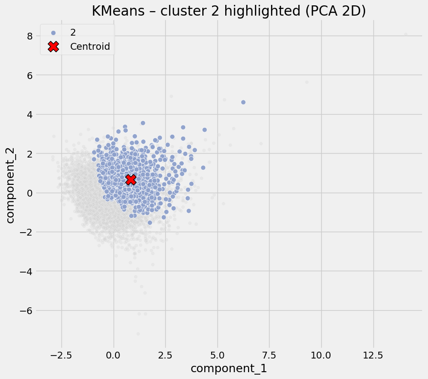

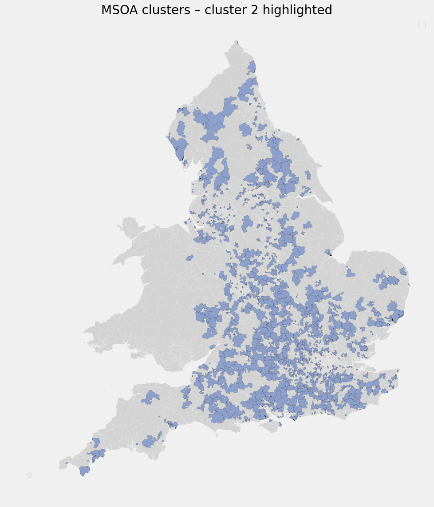

| Cluster | Mean Digital Propensity Score | Mean Covid 19 Inf Rate | Mean Supermarkets | Mean Sports Facilities | Observations |
|:------- |:------------------------------|:-----------------------|:------------------|:-----------------------|:-------------|
| 2	      | 0.943	                        | 312.4	                 | 1.92	             | 30.96	                | 1016         |

Defining characteristics:
  - Moderate digital propensity
  - Extremely high sports and leisure facility density
  - Only moderate retail presence
  - Elevated COVID rates

<b>Interpretation</b>

COVID risk here appears driven by social congregation, not deprivation or lack of digital access. Typical examples may include campuses, large leisure complexes, or multi-use community hubs.


#### Cluster 3 - Digitally Constrained Residential Areas

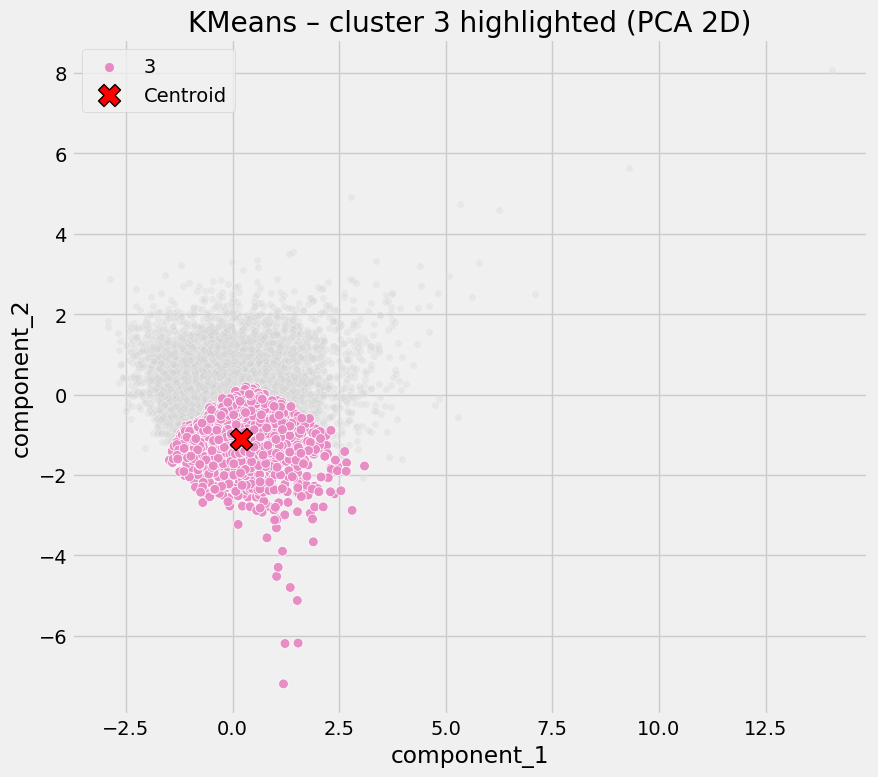

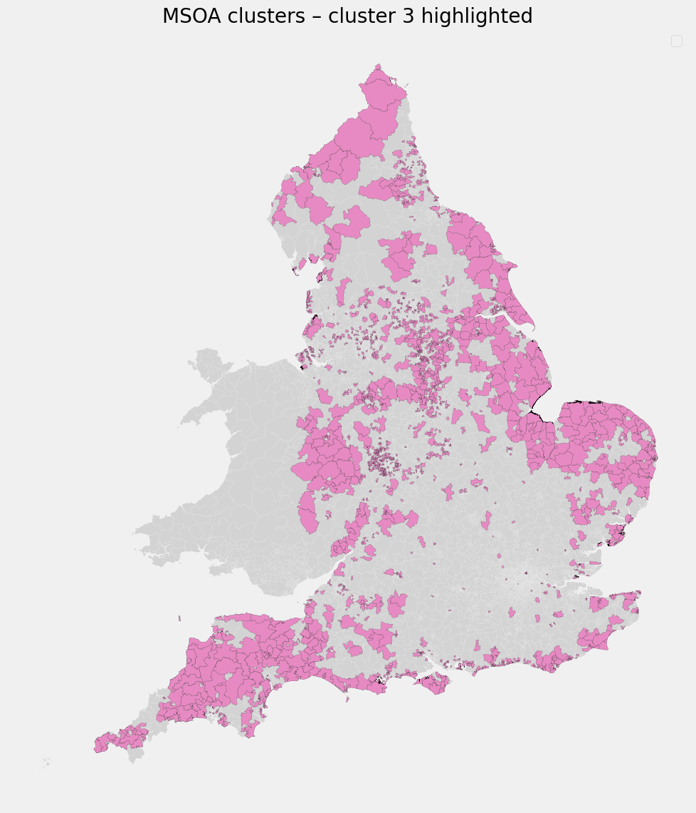

| Cluster | Mean Digital Propensity Score | Mean Covid 19 Inf Rate | Mean Supermarkets | Mean Sports Facilities | Observations |
|:------- |:------------------------------|:-----------------------|:------------------|:-----------------------|:-------------|
| 3	      | 0.921	                        | 306.6	                 | 1.89	             | 11.87	                | 1745         |

Defining characteristics:
  - Lowest digital propensity
  - Low amenity access
  - Average COVID rates

<b>Interpretation</b>

These areas lack both digital alternatives and local infrastructure, leaving residents more exposed when restrictions require behavioral change. Risk here is structural rather than behavioral.


#### Cluster 4 - High-Risk Exposure Hotspots

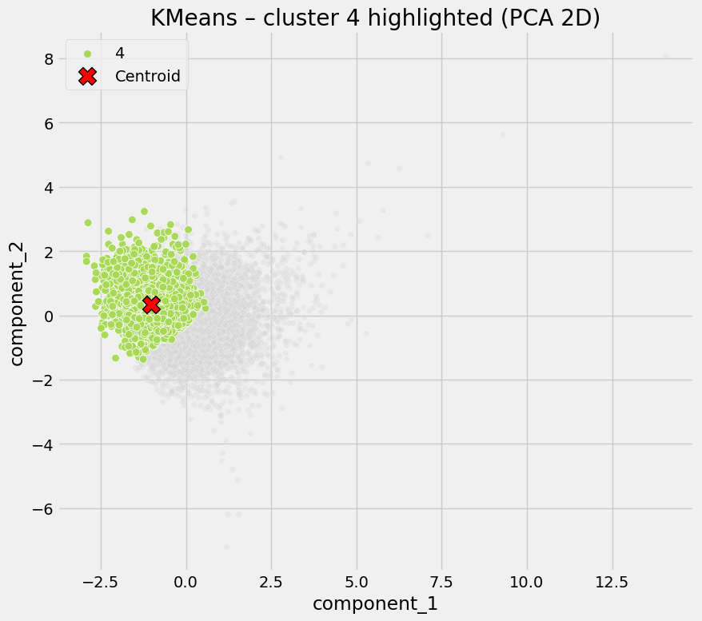

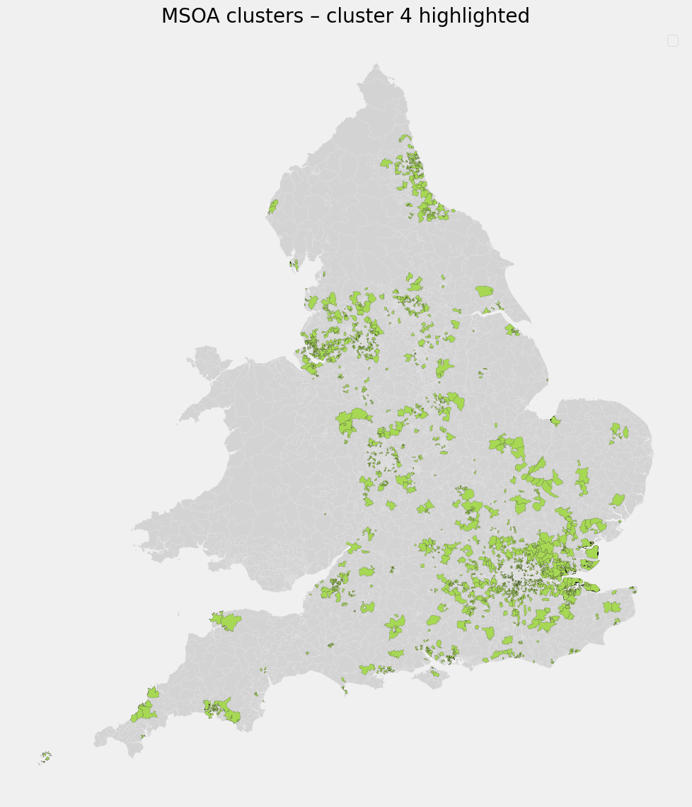

Defining characteristics:
  - Digital propensity similar to other clusters
  - No exceptional amenity access
  - Highest COVID rates by a clear margin

<b>Interpretation</b>

This cluster is defined by outcomes rather than inputs. High infection rates likely reflect unobserved factors (e.g. care settings, workplaces, housing density) not captured in the current data set.

***

### Purpose
The objective of this analysis is to understand how patterns of COVID infection relate to digital capability and access to physical amenities, by identifying distinct types of places rather than analysing individual variables in isolation.

<b>Data & Method</b>

Data used is area-level data containing:
  - [COVID-19 infection rates](https://ukhsa-dashboard.data.gov.uk/covid-19-archive-data-download)
  - [Counts of supermarkets](https://www.ons.gov.uk/peoplepopulationandcommunity/wellbeing/datasets/1numberofchainsupermarketsacrosslocalauthoritydistrictsladandsmallergeographicalareasintheuk) 
  - [Counts of sports and leisure facilities](https://www.ons.gov.uk/peoplepopulationandcommunity/wellbeing/datasets/numberofsportsfacilitiesacrosslocalauthoritydistrictsladandmiddlelayersuperoutputareasmsoainenglandandwales)
  - [MSOA GeoJSON](https://www.data.gov.uk/dataset/b9d6e8eb-95a8-4a32-832f-e8a746252f43/middle-layer-super-output-areas-december-2021-boundaries-ew-bfc-v7)
  - [Digital propensity scores](https://www.ons.gov.uk/peoplepopulationandcommunity/householdcharacteristics/homeinternetandsocialmediausage/datasets/digitalpropensityindexforcensus2021atlowerlayersuperoutputareaslsoasenglandandwales)
    - [ONS Geography - Postcode to OA](https://geoportal.statistics.gov.uk/datasets/7fc55d71a09d4dcfa1fd6473138aacc3)

To reduce dimensionality and minimise multicollinearity, the input features were first transformed using Principal Component Analysis (PCA). k-Means clustering was then applied to group areas into clusters with similar underlying characteristics.

This approach allows for identification of place-based typologies rather than one dimensional explanations.

All data used is publically available.


### Potential Application
This place typology can inform targeted policymaking and resource allocation in both pandemic response and digital inclusion initiatives. Public health authorities could use these insights to develop prioritisation zones in the event of a future pandemic.

For example, areas identified as “digitally constrained” (low digital access, low amenities) might be prioritised for support during lockdowns (mobile testing units, food delivery assistance, etc.), as residents have fewer means to cope with restrictions. On the other hand, areas labelled as “high social interaction zones” or “commercial centres” could be focal points for outbreak control measures.

Beyond immediate pandemic response, the findings highlight where to invest in digital literacy and infrastructure. If low digital propensity is linked to worse health outcomes, improving digital access in those communities becomes not just an economic or social goal but a health resilience strategy. 

Fundamentally, this analysis provides a baseline for building patterns of risk and resilience based on place, not people. It is scalable, where additional data such as healthcare access, education level, etc. can be incorporated to refine the clusters.
It offers a template for multidisciplinary interventions (combining digital policy with public health). In summary, the clustering results are directly usable for crafting nuanced, location-specific policies for both pandemic mitigation and digital inclusion strategies.


### Bias & Other Research
It has been well researched that COVID infection and mortality rates affected people from an ethnic minority group, disabled and women (etc.) disproportionally. 

Therefore, it is reasonable to assume that this will be reflected in the projects base data. This could be represented by:
  - Income & Job type
  - Neighbourhood deprivation
  - Age, Gender, Ethnicity, Disability

[Gov.uk - Health Inequalities, Deprivation, Poverty and Covid-19 Research](https://www.local.gov.uk/health-inequalities-deprivation-and-poverty-and-covid-19#:~:text=The%20unequal%20impact%20of%20the,Storm%20report%2C%20published%20April%202021.)

[Gov.uk - Indices of Deprivation 2025](https://www.gov.uk/government/statistics/english-indices-of-deprivation-2025/english-indices-of-deprivation-2025-statistical-release)


### Encyclopedia

  - LSOA = Lower Layer Super Output Area, which represents a group of postcodes in an area.
  - MSOA = Middle Layer Super Output Area, which represents a group of LSOA area's and a larger cohort of postcodes.
  - DPS = Digital Propensity Score. 
  - PCA = Principal Component Analysis.

***

## Approach

A full python notebook including all steps taken is available [here](/k-Means%20Clustering%20Covid-DPS.ipynb). 

Data was collected from publically available sources and pre-processed before analysis into the required shape via Excel and Python. Full details on how this was acomplished are available in the python notebook. 

The shape used in this analysis is MSOA level data.

<b>Tools used:</b>
  - Python 3.11
  - Excel

<b>Python dependencies:</b>
  - ydata-profiling
  - kneed
  - seaborn
  - geopandas
  - pandas
  - matplotlib
  - sklearn
  - numpy
  - imageio.v2
  - IPython.display

```python
!pip install ydata-profiling
!pip install kneed
!pip install seaborn
!pip install geopandas
!pip install pandas
!pip install matplotlib
!pip install sklearn
!pip install numpy
!pip install imageio.v2
!pip install IPython.display
```

<b>Due to file size limits, users will need to download the full MSOA geojson file from [data.gov.uk Site](https://www.data.gov.uk/dataset/b9d6e8eb-95a8-4a32-832f-e8a746252f43/middle-layer-super-output-areas-december-2021-boundaries-ew-bfc-v7), rename it to 'msoa_geo_data.geojson' and place it in the /Files directory. (Direct link download [here](https://open-geography-portalx-ons.hub.arcgis.com/api/download/v1/items/12baf1e6a44441208ffe5ba5ed063a68/geojson?layers=0)).</b>

### Dataset 1
#### Covid rate (MSOA)
Source = [UKHSA](https://ukhsa-dashboard.data.gov.uk/covid-19-archive-data-download)
Files = msoa_newCasesBySpecimenDateRollingRate_areas_letter__ 

These files show the weekly covid rate for each MSOA from 2019-2021

#### Combine the covid msoa data into a single file
Input:  Directory of csv's, broken down by MSOA area names alphabetically. 

Ouput: Single parquet file

```python
import os
import pandas as pd

# Mounted path
path = "Files/covid_msoa_csv"

# Only look for files that end in .csv
csv_files = [f for f in os.listdir(path) if f.lower().endswith(".csv")]

# Create a DataFrame to define each file to process, then concat the files together. 
dfs = [pd.read_csv(os.path.join(path, f)) for f in csv_files]
cdf = pd.concat(dfs, ignore_index=True)

# Output = Parquet 
out_path = os.path.join(path, "msoa_all.parquet")
cdf.to_parquet(out_path, index=False)

# Display shape to confirm data has written correctly
print(cdf.shape)
```

#### Aggregate the msoa rate for 2019-2021 data into a single mean
Takes all the non-null values for each distinct MSOA and aggregates into a single mean value to represent the mean covid rate for 2019-2021 for that MSOA.

```python
# Read the combined parquet file in as a df
pdf = pd.read_parquet("Files/covid_msoa_csv\msoa_all.parquet")

# Extract just the value and area_code (msoa) columns, aggregate into a single Mean rate
msoa_covid = pdf['value'].groupby(pdf['area_code']).mean()

# Write to a DataFrame
msoa_df_covid = pd.DataFrame(msoa_covid)

# Display df to check columns and output
msoa_df_covid

# Output to file for in-depth review
# msoa_df.to_parquet("Files/covid_msoa_csv/msoa_mean.parquet")
```

### Dataset 2
#### Digital Propensity Score (LSOA)
Source = [ONS](https://www.ons.gov.uk/peoplepopulationandcommunity/householdcharacteristics/homeinternetandsocialmediausage/datasets/digitalpropensityindexforcensus2021atlowerlayersuperoutputareaslsoasenglandandwales)

This data has been prepared for MSOA analysis by adding the relevant MSOA code into the dataset.

This was accomplished using [ONS Geography - Postcode to OA](https://geoportal.statistics.gov.uk/datasets/7fc55d71a09d4dcfa1fd6473138aacc3) data via a vLookup in Excel.

#### Aggregate LSOA Digital Propensity Score data into a single MSOA Mean
Takes all the non-null values for each distinct MSOA and aggregates into a single Mean value to represent the Mean DPS.

```python
# Read the file
pdf = pd.read_excel("Files/digitalpropensityindexlsoas.xlsx")

# Group the data by MSOA into a new DataFrame
msoa_dsp = pdf['Digital_Propensity_Score'].groupby(pdf['MSOA']).mean()

# Into a new DataFrame
msoa_df_dsp = pd.DataFrame(msoa_dsp)

# Display the DataFrame
msoa_df_dsp

# Optional - write as a parquet file
# msoa_df.to_parquet("Files/msoa_dps_mean.parquet")
```

### Dataset 3
#### Supermarket availability (MSOA)
Source = [ONS](https://www.ons.gov.uk/peoplepopulationandcommunity/wellbeing/datasets/1numberofchainsupermarketsacrosslocalauthoritydistrictsladandsmallergeographicalareasintheuk)

This data is already in the correct format for analysis.

```python
# Load the file into a DataFrame
msoa_df_sup = pd.read_excel("Files/msoa_supermarkets.xlsx")
```

### Dataset 4
#### Sport Facilities (MSOA)
Source = [ONS](https://www.ons.gov.uk/peoplepopulationandcommunity/wellbeing/datasets/numberofsportsfacilitiesacrosslocalauthoritydistrictsladandmiddlelayersuperoutputareasmsoainenglandandwales)

This data is already in the correct format for analysis.

```python
# Load the data into a Dataframe
msoa_df_sport = pd.read_excel("Files/msoa_sport_facilities.xlsx")
```

#### Combine the data together into a single Dataframe
There are only 6791 rows in the covid dataset compared to 7248 rows in the digital propensity score dataset.(-457)

On review, this is because some of the msoa's are no longer in use (decommissioned).

Combining the four datasets using an <b>inner</b> join will eliminate the null values.

```python 
# Reset the index area_code and bring it in as a column
msoa_df_covid2 = msoa_df_covid.reset_index()

# Merge the two dataframes together to return a single unified df
msoa_clustering_df = msoa_df_dsp.merge(
    msoa_df_covid2[['area_code', 'value']],
    left_on='MSOA',
    right_on='area_code',
    how='inner'
)

# Merge the supermarket data in
msoa_clustering_df = msoa_clustering_df.merge(
    msoa_df_sup[['msoa_code', 'count_of_supermarkets']],
    left_on='area_code',
    right_on='msoa_code',
    how='inner'
)

# Merge the sport facility data in
msoa_clustering_df = msoa_clustering_df.merge(
    msoa_df_sport[['msoa_code', 'numb_sport_facilities']],
    left_on='area_code',
    right_on='msoa_code',
    how='inner'
)

# Rename columns for readability
msoa_clustering_df = msoa_clustering_df.rename(columns={"Digital_Propensity_Score": "mean_dp_score", "value": "mean_covid_rate"})

# Create new DataFrame and select the columns required
msoa_clustering_df = msoa_clustering_df[['area_code','mean_dp_score','mean_covid_rate','count_of_supermarkets','numb_sport_facilities']]

# Preview the data to confirm correct
msoa_clustering_df
```
Using .describe() to review the output for error checking.

There are no nill values for covid or digital propensity, which means the inner join worked in removing the 457 null values which are due to the MSOA's being decommissioned. 

```python
msoa_clustering_df.describe()
```

Using .info() will provide the non-null count and data types.

This confirms the data has been loaded correctly as all the types are integer/float's (aside from the MSOA codes). 

```python 
msoa_clustering_df.info()
```

### Explorative Data Analysis
#### Check for duplicates

```python
sum(msoa_clustering_df.duplicated())
```
Out: 0

```python
# Return any duplicate values for review
msoa_clustering_df[msoa_clustering_df.duplicated()]
```
Out: NULL

```python
# Summarise the number of not null values
msoa_clustering_df.notnull().sum() 
```

|area_code                |6677|
|mean_dp_score            |6677|
|mean_covid_rate          |6677|
|count_of_supermarkets    |6677|
|numb_sport_facilities    |6677|
dtype: int64

#### EDA using ydata profiling

<b>IMPORTANT!</b>
Don't run this if you want to view any of the seaborn/matplotlib/geopandas graphs later on, as ydata_profiling prevents them from displaying.

```python
# Don't run this if you want matplotlib plots to load. ydata prevents them from loading.
from ydata_profiling import ProfileReport

# https://docs.profiling.ydata.ai/latest/

profile = ProfileReport(msoa_clustering_df, title="-Means Clustering EDA Report",explorative=True)
profile.to_notebook_iframe()
```
#### EDA Overview
There are no duplicate or null values.

The data spread looks healthy with a range of values in each category without there being any outliers.

### k-Means Clustering

Import the required libraries, preserve the id column in a DataFrame then drop it ready for analysis.

```python
# Import the required libraries
import numpy as np
import pandas as pd
import matplotlib.pyplot as plt
import seaborn as sns

from sklearn.impute import SimpleImputer
from sklearn.preprocessing import StandardScaler
from sklearn.decomposition import PCA
from sklearn.cluster import KMeans
from sklearn.metrics import silhouette_score

# Re-point the DataFrame to df for cleanliness
df = msoa_clustering_df

# Keep ID column safe
id_col = "area_code"
ids = df[id_col].astype(str)

# Numeric features set (exclude area_code)
X = df.drop(columns=[id_col]).copy()

# Basic numeric-only safety
X = X.select_dtypes(include=[np.number])

```

Impute any missing values (handled earlier with an inner join) then apply principal component analysis (PCA) at a 95% variance. This will flatten the data then split it into 2 components that can be used on a scatter graph later on.

```python
# Impute missing values then standardise - The data doesn't have any missing values but kept this step in as important
imputer = SimpleImputer(strategy="median")
scaler = StandardScaler()

X_imp = imputer.fit_transform(X)
X_scaled = scaler.fit_transform(X_imp)

# PCA space for clustering (95% variance)
pca_cluster = PCA(n_components=0.95, random_state=42)
X_pca = pca_cluster.fit_transform(X_scaled)

# PCA space for plotting with 2 components (Used for plotting the X & Y values)
pca_plot = PCA(n_components=2, random_state=42)
X_2d = pca_plot.fit_transform(X_scaled)

pcadf = pd.DataFrame(X_2d, columns=["component_1", "component_2"])
pcadf[id_col] = ids.values
```

Initialise the k with a range of 3-16. 

```python
# Initialise the k_range for identifying the number of clusters needed
k_range = range(3, 16)
inertias = []
silhouettes = []

for k in k_range:
    km = KMeans(n_clusters=k, n_init=20, random_state=42)
    labels = km.fit_predict(X_pca)
    inertias.append(km.inertia_)
    silhouettes.append(silhouette_score(X_pca, labels))
```

Run with k_selected as 0 initially, then re-run once the number of clusters has been identified.

This will show the elbow graph and silhouette graph for identifying the ideal number of k.

```python
# Start with 0 (not shown as min number of k = 3 here). Then re-run with the number of k selected to highlight
k_selected = 5 

fig, ax = plt.subplots(1, 2, figsize=(14, 5))

# Elbow plot (Inertia)
ax[0].plot(list(k_range), inertias, marker="o", label="Inertia")

if k_selected in k_range
:
    idx = list(k_range).index(k_selected)
    ax[0].scatter(
        k_selected,
        inertias[idx],
        color="red",
        s=120,
        zorder=5,
        label=f"Selected k = {k_selected}"
    )

ax[0].set_title("Elbow method (inertia vs k)")
ax[0].set_xlabel("k")
ax[0].set_ylabel("inertia (SSE)")
ax[0].legend()


# Silhouette plot
ax[1].plot(list(k_range), silhouettes, marker="o", label="Silhouette score")

if k_selected in k_range:
    idx = list(k_range).index(k_selected)
    ax[1].scatter(
        k_selected,
        silhouettes[idx],
        color="red",
        s=120,
        zorder=5,
        label=f"Selected k = {k_selected}"
    )

ax[1].set_title("Silhouette score vs k")
ax[1].set_xlabel("k")
ax[1].set_ylabel("mean silhouette score")
ax[1].legend()

plt.tight_layout()
plt.show()
```

Left = Elbow graph, which trails off around 4-5 clusters.
Right = Silhouette graph, showing a clear spike at 5 clusters.

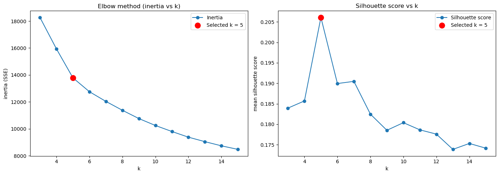

Next, apply the k-means algorithm with the number of clusters selected.

```python
# Initialise the k-Means algorithm with the number of k selected
k = 5  
kmeans = KMeans(n_clusters=k, n_init=50, random_state=42)
clusters = kmeans.fit_predict(X_pca)
```

Define the cluster colours for continuity.

```python
# Cluster colour mapping - this helps to standardise the colours in further visuals
CLUSTER_COLOURS = {
    0: "#66c2a5",  # teal
    1: "#fc8d62",  # orange
    2: "#8da0cb",  # blue
    3: "#e78ac3",  # pink
    4: "#a6d854",  # green
}
```

Apply the clusters to the 2 dimensional PCA co-ordinates and display on a scatter graph.

```python
# Add the clusters for each row of data into the pca df 
pcadf["predicted_cluster"] = clusters

# Centroid positions in the plotted 2D PCA coordinates
centroids_2d = (
    pcadf.groupby("predicted_cluster")[["component_1", "component_2"]]
    .mean()
    .reset_index()
)

plt.style.use("fivethirtyeight")
plt.figure(figsize=(9, 8))

ax = sns.scatterplot(
    data=pcadf,
    x="component_1",
    y="component_2",
    hue="predicted_cluster",
    palette=CLUSTER_COLOURS,   # Map the cluster colours
    s=45,
    alpha=0.85
)

# Plot centroids as red X
plt.scatter(
    centroids_2d["component_1"],
    centroids_2d["component_2"],
    c="red",
    s=250,
    marker="X",
    edgecolor="black",
    linewidth=1.0,
    label="Centroids"
)

ax.set_title("KMeans clusters (PCA 2D) with centroids")
plt.legend(bbox_to_anchor=(1.02, 1), loc="upper left")
plt.tight_layout()
plt.show()
```

The cluster centroids are marked with red X's. This shows that the data is quite dense in one location with very few outliers. 

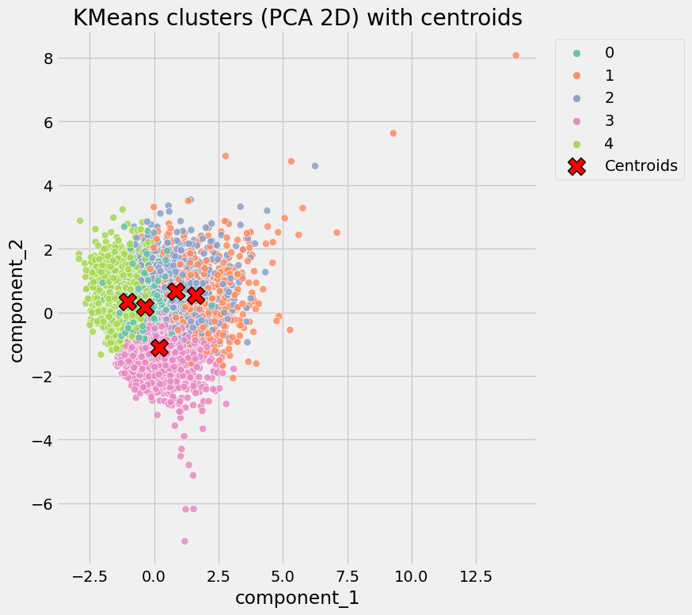

Bring the clusters and PCA dimensions back into the original dataframe for review. 

```python
# Copy the df (preserve the pcadf if needed later on) for processing msoa map data
clustered_df = df.copy()
clustered_df["cluster"] = clusters

# Add PC1/PC2 for convenience
clustered_df = clustered_df.merge(
    pcadf[[id_col, "component_1", "component_2", "predicted_cluster"]],
    on=id_col,
    how="left"
).drop(columns=["predicted_cluster"])

clustered_df.head()
```

| area code  | mean dp score | mean covid rate | count of supermarkets | numb sport facilities | cluster | component 1 | component 2 |
|:-----------|:--------------|:----------------|:----------------------|:----------------------|:--------|:------------|:------------|
| E02000001  | 0.964833      | 310.349612	     | 32                    | 96                    | 1       | 14.055175   | 8.071071    |
| E02000002  | 0.945250      | 317.687805	     | 1                     | 2                     | 0       | -1.117344   | -0.267793   |
| E02000003  | 0.948833      | 279.755319	     | 2                     | 16	                   | 0       | 0.443506    | 0.183580    |
| E02000004  | 0.936500      | 362.836842	     | 1                     | 15	                   | 4       | -0.933621   | 0.126094    |
| E02000005  | 0.956250      | 311.492742	     | 3                     | 5                     | 0       | -0.355278   | 0.600385    |

Display the results of the clusters against the msoa on a map.

```python
import geopandas as gpd
from matplotlib.colors import ListedColormap

msoa_path = "Files/msoa_geo_data.geojson"
msoa_gdf = gpd.read_file(msoa_path)

# Find MSOA code column automatically
code_candidates = [c for c in msoa_gdf.columns if "MSOA" in c.upper() and c.upper().endswith("CD")]
msoa_code_col = code_candidates[0] if code_candidates else "MSOA21CD"

# Join cluster results
join_df = clustered_df[[id_col, "cluster"]].copy()

map_gdf = msoa_gdf.merge(
    join_df,
    left_on=msoa_code_col,
    right_on=id_col,
    how="left"
)

# Create a fixed categorical colormap in cluster order
cluster_order = sorted(CLUSTER_COLOURS.keys())
cmap = ListedColormap([CLUSTER_COLOURS[c] for c in cluster_order])

# Plot choropleth
fig, ax = plt.subplots(1, 1, figsize=(10, 12))
map_gdf.plot(
    column="cluster",
    categorical=True,
    legend=True,
    cmap=cmap, # Map the colours
    linewidth=0.1,
    edgecolor="white",
    ax=ax,
    missing_kwds={"color": "lightgrey", "label": "No data"}
)

ax.set_axis_off()
ax.set_title("MSOA clusters (England & Wales)")
plt.tight_layout()
plt.show()
```


Summary findings. 

```python
from IPython.display import display

# Group by cluster and compute summary statistics
cluster_summary = (
    clustered_df
    .groupby('cluster')
    .agg(
        mean_dp_score=('mean_dp_score', 'mean'),
        mean_covid_rate=('mean_covid_rate', 'mean'),
        mean_supermarkets=('count_of_supermarkets', 'mean'),
        mean_sport_facilities=('numb_sport_facilities', 'mean'),
        n_areas=('cluster', 'count')
    )
    .reset_index()
)

# Round for readability
cluster_summary = cluster_summary.round({
    'mean_dp_score': 3,
    'mean_covid_rate': 1,
    'mean_supermarkets': 2,
    'mean_sport_facilities': 2
})

# Display
display(cluster_summary)
```

| Cluster | Mean Digital Propensity Score | Mean Covid 19 Inf Rate | Mean Supermarkets | Mean Sports Facilities | Observations |
|:------- |:------------------------------|:-----------------------|:------------------|:-----------------------|:-------------|
| 0	      | 0.953	                        | 289.7	                 | 1.48	             | 8.26	                  | 1322         |
| 1	      | 0.940	                        | 301.9	                 | 5.86	             | 17.65	                | 721          |
| 2	      | 0.943	                        | 312.4	                 | 1.92	             | 30.96	                | 1016         |
| 3	      | 0.921	                        | 306.6	                 | 1.89	             | 11.87	                | 1745         |
| 4	      | 0.944	                        | 353.6	                 | 1.48	             | 10.09	                | 1873         |

